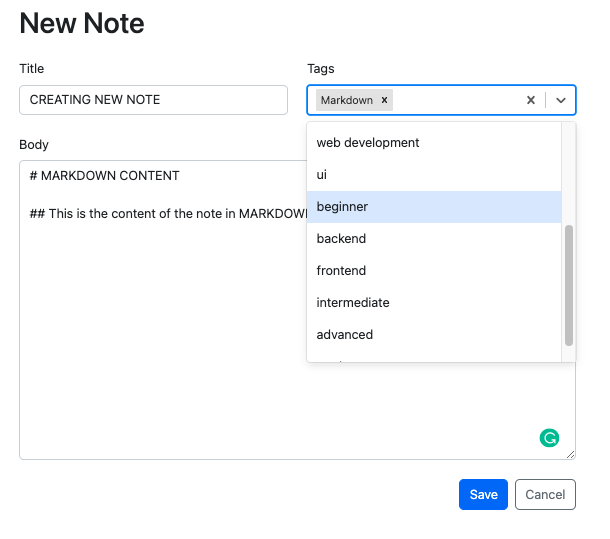
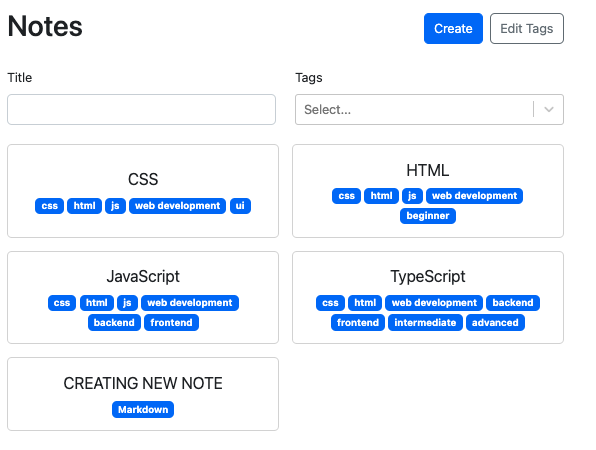
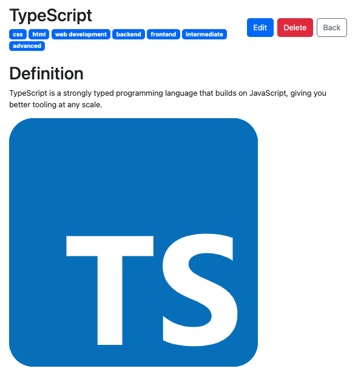
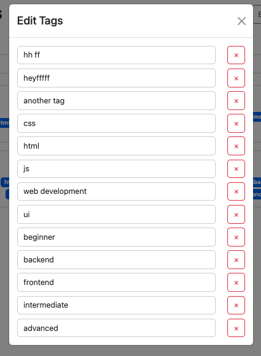

# TypeScript Todos

 
 

This is an advanced to-do list using TypeScript and React. Users have the ability to filter, create, delete, edit and update their notes. Fully responsive and written with clean, easy to understand code!

### Creating new note:

### Homepage with created note:

### Example of note with markdown supported content:

### Editing tags:

